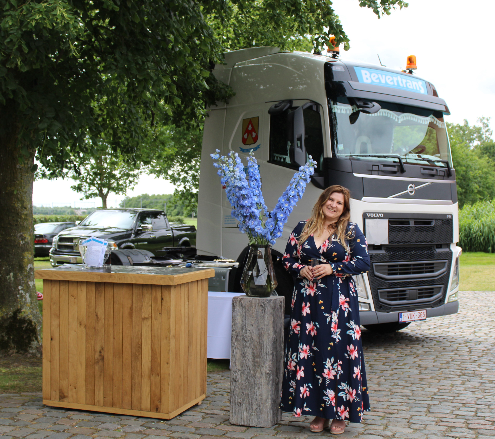
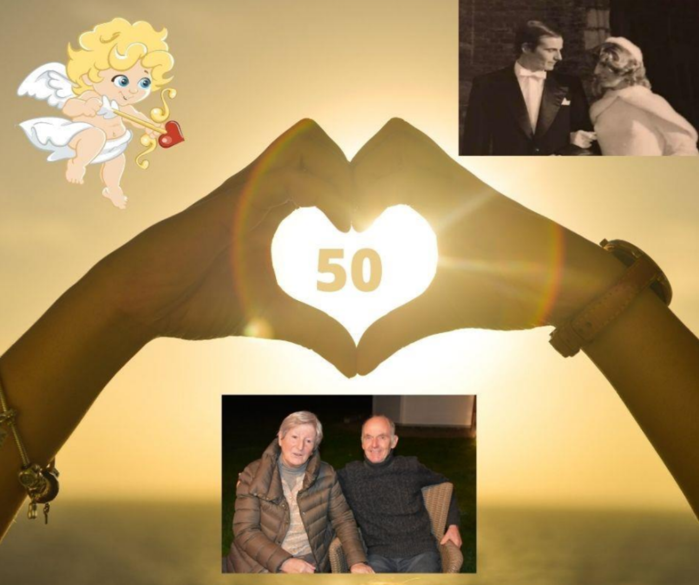

Bij Ferm-Veldegem hebben we meer dan 220 dames die stuk voor stuk Wauw-Vrouw zijn, door wie ze zijn, door wat ze doen, door wat ze betekenen voor anderen of door gewoon zichzelf te zijn!

Iedereen aan elkaar voorstellen, dat willen we graag, maar lukt echt niet.

Maar elke maand er eentje voorstellen: dat kunnen we wel!

- [Marlotte Verhegge is Wauw-Vrouw van Januari](#marlotte-verhegge-is-wauw-vrouw-van-januari)
- [Lena Callens is Wauw-Vrouw van Februari](#lena-callens-is-wauw-vrouw-van-februari)

## Marlotte Verhegge is Wauw-Vrouw van Januari

Ontmoet de Wauw-Vrouw van januari: Marlotte Verhegge

Is het omdat Marlotte binnenkort jarig is of is het omdat ze straks mama wordt?
Of is het omdat ze, samen met haar zussen, een transportbedrijf runt?
Niet echt. Maar waarom dan wel?

**Kunst Na Arbeid koos voor het eerst in hun 76 jarig bestaan, een vrouwelijke
voorzitter: Marlotte!**

We kunnen die beslissing als vrouwenvereniging enkel maar toejuichen.

Proficiat, Marlotte. Jij gaat dit goed doen!

## Lena Callens is Wauw-Vrouw van Februari

Bij Ferm-Veldegem hebben we meer dan 220 dames die stuk voor stuk Wauw-Vrouw zijn,
door wie ze zijn, door wat ze doen, door wat ze betekenen voor anderen of door gewoon
zichzelf te zijn.

Iedereen aan elkaar voorstellen, dat willen we graag, maar lukt echt niet.
Maar elke maand er eentje voorstellen: dat kunnen we wel!

Ontmoet de Wauw-Vrouw van februari: **Lena Callens**

Lena is al meer dan 25 jaar teamlid. Ze is een creatieve duizendpoot & stond ontelbare keren op de Ferm-planken. Ze houdt van sappige verhalen. Ze zit vol talenten.

Nu haar gezondheid het haar knap lastig maakt, volgt ze toch nog steeds het reilen en zeilen van onze vereniging op de voet en helpt ze achter de schermen waar ze kan.

In de periode van Valentijn is ‘liefde is’, niet weg te denken.

Lena & Marc zijn hier toch wel het gepaste voorbeeld van.
Met hun 50-jarig huwelijk zijn ze een toonbeeld voor velen: in goede en kwade dagen, in ziekte en gezondheid, door dik en dun, ...

Proficiat, Lena & Marc, en geniet van de komende jaren samen!

