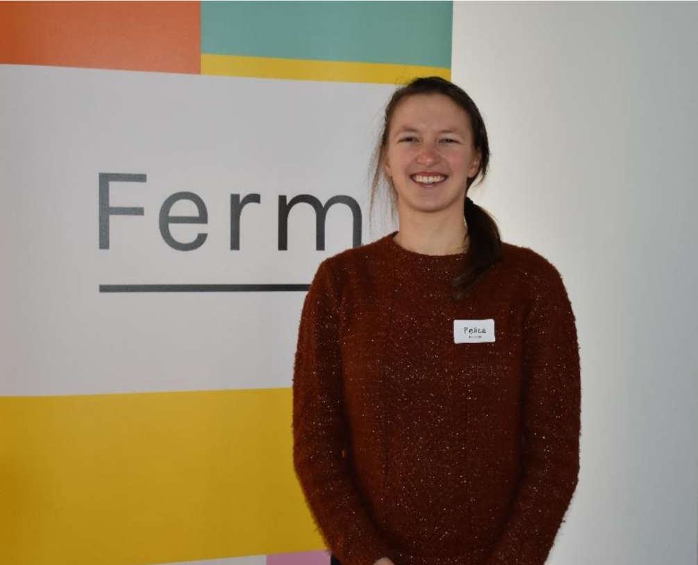
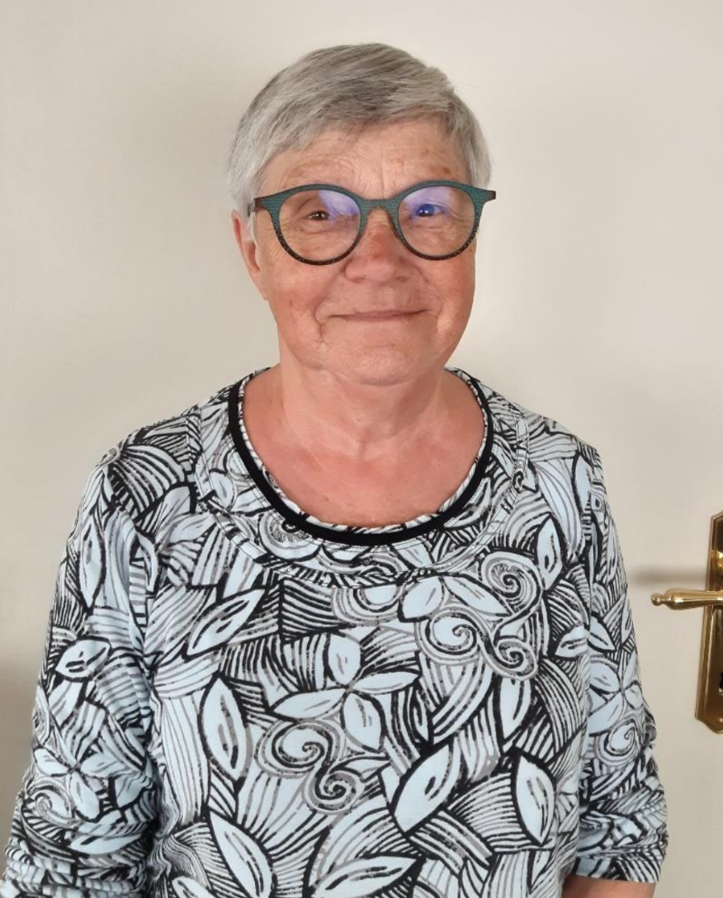

Bij Ferm-Veldegem hebben we meer dan 220 dames die stuk voor stuk Wauw-Vrouw zijn, door wie ze zijn, door wat ze doen, door wat ze betekenen voor anderen of door gewoon zichzelf te zijn!

Iedereen aan elkaar voorstellen, dat willen we graag, maar lukt echt niet.

Maar elke maand er eentje voorstellen: dat kunnen we wel!

- [Marlotte Verhegge is Wauw-Vrouw van Januari](#marlotte-verhegge-is-wauw-vrouw-van-januari)
- [Lena Callens is Wauw-Vrouw van Februari](#lena-callens-is-wauw-vrouw-van-februari)
- [Elise Mingneau is Wauw-Vrouw van Maart](#elise-mingneau-is-wauw-vrouw-van-maart)
- [Felice Keereman is Wauw-Vrouw van April](#felice-keereman-is-wauw-vrouw-van-april)
- [Marcella Cools is Wauw-Vrouw van Mei](#marcella-cools-is-wauw-vrouw-van-mei)

## Marlotte Verhegge is Wauw-Vrouw van Januari

Ontmoet de Wauw-Vrouw van januari: Marlotte Verhegge

Is het omdat Marlotte binnenkort jarig is of is het omdat ze straks mama wordt?
Of is het omdat ze, samen met haar zussen, een transportbedrijf runt?
Niet echt. Maar waarom dan wel?

**Kunst Na Arbeid koos voor het eerst in hun 76 jarig bestaan, een vrouwelijke
voorzitter: Marlotte!**

We kunnen die beslissing als vrouwenvereniging enkel maar toejuichen.

Proficiat, Marlotte. Jij gaat dit goed doen!

## Lena Callens is Wauw-Vrouw van Februari

Bij Ferm-Veldegem hebben we meer dan 220 dames die stuk voor stuk Wauw-Vrouw zijn,
door wie ze zijn, door wat ze doen, door wat ze betekenen voor anderen of door gewoon
zichzelf te zijn.

Iedereen aan elkaar voorstellen, dat willen we graag, maar lukt echt niet.
Maar elke maand er eentje voorstellen: dat kunnen we wel!

Ontmoet de Wauw-Vrouw van februari: **Lena Callens**

Lena is al meer dan 25 jaar teamlid. Ze is een creatieve duizendpoot & stond ontelbare keren op de Ferm-planken. Ze houdt van sappige verhalen. Ze zit vol talenten.

Nu haar gezondheid het haar knap lastig maakt, volgt ze toch nog steeds het reilen en zeilen van onze vereniging op de voet en helpt ze achter de schermen waar ze kan.

In de periode van Valentijn is ‘liefde is’, niet weg te denken.

Lena & Marc zijn hier toch wel het gepaste voorbeeld van.
Met hun 50-jarig huwelijk zijn ze een toonbeeld voor velen: in goede en kwade dagen, in ziekte en gezondheid, door dik en dun, ...

Proficiat, Lena & Marc, en geniet van de komende jaren samen!

## Elise Mingneau is Wauw-Vrouw van Maart

Op radio 2 worden ze **'weldoeners'** genoemd. Mooie naam voor de talrijke vrijwilligers!
Tal van onze dames geven het beste van zichzelf in ziekenhuizen, WZC’s, CAW’s, scholen, ouder- en schoolraden, sport- en cultuurverenigingen, ... en dat allemaal op vrijwillige basis en in de vrije tijd.

Eéntje pikken we er uit: ontmoet de Wauw-vrouw van maart: **Elise Mingneau**

Samen met haar partner Jeroen en haar 2 sloebers woont Elise ongeveer 10 jaar in Veldegem.

Ze is een sportief iemand die graag loopt en ook de koersfiets opstapt.

Sinds een 4-tal jaar is ze lid van Ferm Veldegem. Begin dit jaar kregen we een positief antwoord op onze vraag
om teamlid te worden.

Dankjewel, Elise, voor je engagement!

Fijn om jou in het team te mogen verwelkomen.
Samen kleuren we de dagen van onze dames extra mooi.

## Felice Keereman is Wauw-Vrouw van April

Felice Keereman is een geboren Moerbruggenaar. Ze woont sinds maart ’19 in de Bosserijstraat te Veldegem.  
Dit samen met haar man en sinds ongeveer 6 maanden, met hun zoontje.

Felice werkt als ergo-therapeute in een woonzorgcentrum. Momenteel staan haar hobby’s wat op een laag pitje door de combinatie van gezin met werk.

Maar gelukkig koos ze toch om onthaal-lid te worden bij Ferm Veldegem. Ferm is haar niet vreemd want zowel haar mama als tante zijn vertrouwd met de werking in andere gemeentes. Felice wil graag het dorp en de inwoners beter leren kennen.

Welkom Felice in ons bruisende Veldegem, welkom in onze groep met enthousiaste dames. We ontvangen jou met open armen!

## Marcella Cools is Wauw-Vrouw van Mei

Meimaand = Mariamaand. We hebben wel enkele Maria’s bij onze leden.  
Maar we hebben ook iemand die jaar in jaar uit Maria verzorgt!

Ontmoet de Wauw-vrouw van mei: **Marcella Cools**.

Marcella woont, met haar man, in de Hollevoordestraat. Heel dicht bij het Mariakapelletje.

Sinds jaar en dag neemt ze het onderhoud van dat kapelletje op zich. Het ligt er altijd spic & span bij.
Dankjewel, Marcella, voor jouw engagement. Je maakt Veldegem een stukje mooier.

